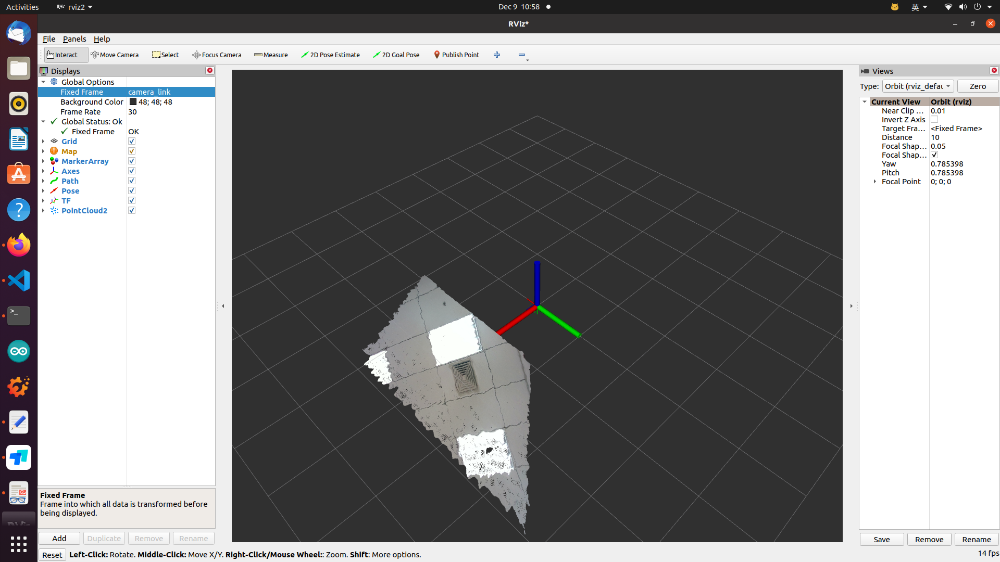
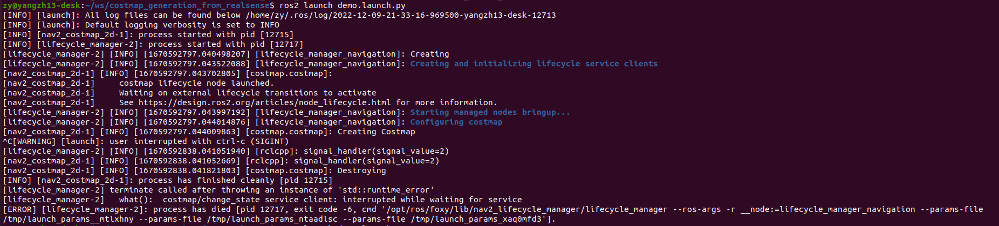

# costmap_generation_from_realsense
1. Realsen can publish pointcloud using following command.
```
ros2 launch realsense2_camera rs_launch.py device_type:=d455 initial_reset:=true log_level:=info filters:=pointcloud align_depth:=true
```
The result is as follows:


2.Because nodes in package "navigation2" is managed by [lifecycle](https://navigation.ros.org/setup_guides/lifecycle_composition/setup_lifecycle_composition.html?highlight=lifecycle), so i can't directly "ros2 run nav2_costmap_2d". I refer to [this issue](https://github.com/ros-planning/navigation2/issues/1240) and write the launch files.(demo.launch.py, demo2.launch.py). The commands are as follows
```
ros2 launch demo.launch.py
ros2 launch demo2.launch.py params_file:=/home/zy/ws/costmap_generation_from_realsense/example_params.yaml
```
Both can successfully launch the node "nav2_costmap_2d" as the following picture

But it sticks on "Creating Costmap".
For now, I don't know why. 

Then, i compile package "navigation2" from source code and test.
Lifecycle manager servers as client and costmap_2d servers as server.

As shown in 108 lines code, Lifecycle manager can not "wait_for_service".
I am debugging on it.